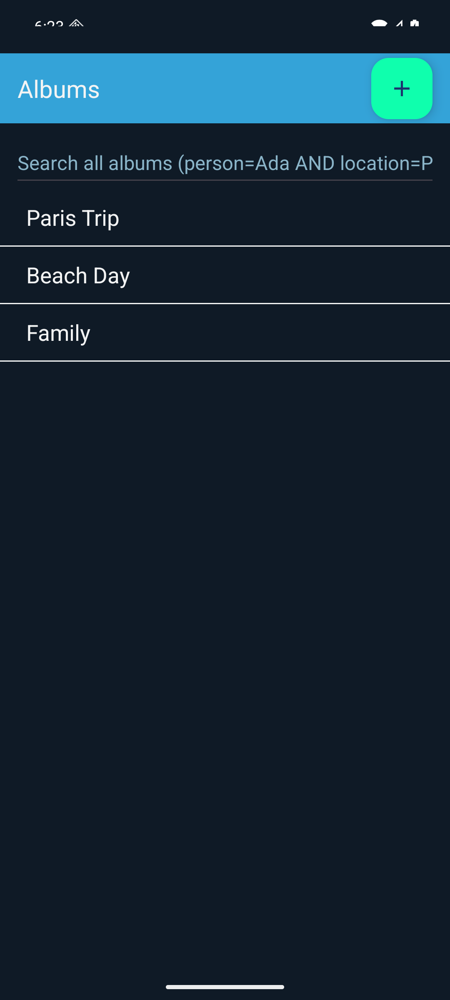
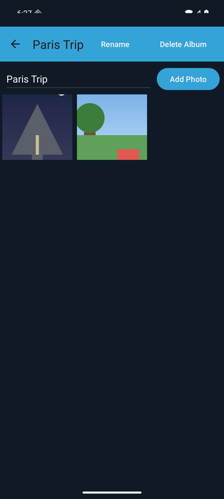
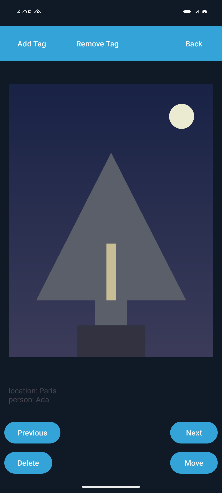
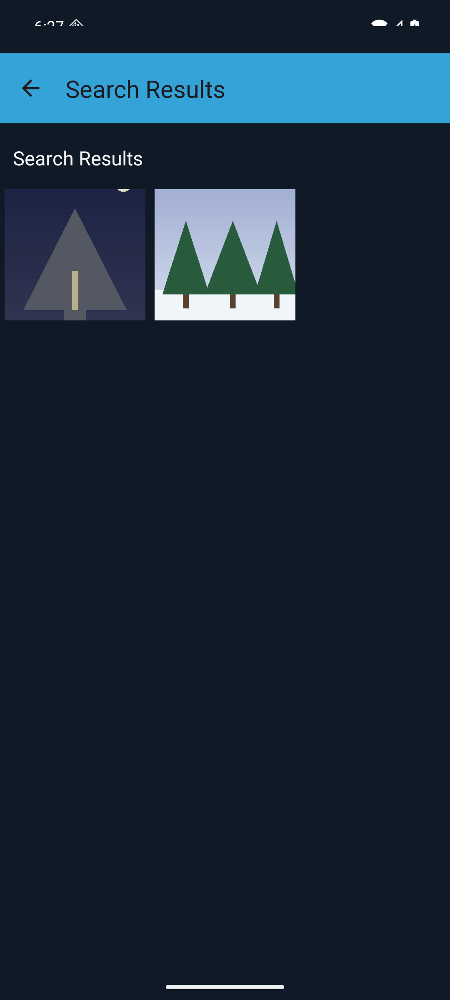

# Photo Album

A modern Android photo album application built with Material 3, AndroidX, and modern
Java. Create albums, add photos, tag them with `person` and `location`, and
search across every album with a small query language.

## Screenshots

| Albums | Album grid | Photo detail | Search results |
|---|---|---|---|
|  |  |  |  |

## Features

- **Albums** — create, rename, and delete albums.
- **Photos** — add photos to albums using the Android Documents picker, with
  persistent URI permissions across app restarts.
- **Typed tags** — tag photos with `person` and `location` values; tag keys are
  validated and stored in a typed, case-normalized form.
- **Search** — query across all albums with a small expression language:
  ```
  person=Ada
  location=Paris
  person=John AND location=New York
  person=John OR location=LA
  ```
  Tag matching is case-insensitive and value is a **prefix match**, so
  `person=jo` matches `person=John`. `AND` and `OR` are also case-insensitive.
  A query that contains more than one operator is rejected.
- **Move / delete / rename** — move a photo between albums, rename an album,
  or delete a photo or an album.
- **Persistence** — JSON on disk with atomic rename + best-effort copy.
  Temporary "search results" albums are never written.
- **Material 3 dark + light theme** — via `Theme.Material3.DayNight.NoActionBar`.

## Project structure

```
app/
  src/main/java/com/example/photos/
    Album.java          — Album model
    AlbumStore.java     — JSON persistence + search + album-name lookup
    OpenAlbum.java      — album-detail screen (RecyclerView of photos, add/rename/delete)
    OpenPhoto.java      — photo detail screen (Glide, add/remove tag, move, delete)
    Photo.java          — photo entity with typed tags and prefix-match query
    Photos.java         — home activity (list + search bar + global state holder)
    Tag.java            — typed tag, validated to person/location
  src/test/java/com/example/photos/
    AlbumSearchTest.java     — query language and matching rules
    AlbumStoreTest.java      — save/load round-trip, dedupe, temp-album skip
    PhotoTagTest.java        — tag add/delete/copy/equals, album add/findByFilePath
  src/main/res/
    layout/           — ConstraintLayout / RecyclerView layouts
    values/           — strings, colors, Material 3 themes (light + night)
    mipmap*/         — launcher icons
    menu/             — single-item "Add album" action
```

## Build and run

### Requirements

- Android Studio (Narwhal 2025.1.1 or newer) or command-line
- JDK 17 or newer (CI uses 21)
- Android SDK with `platforms;android-36`, `build-tools;36.0.0`
- The Gradle wrapper (`./gradlew`) handles everything else

### From a terminal

```bash
# 1. Point gradle at your SDK
echo "sdk.dir=$HOME/Library/Android/sdk" > local.properties

# 2. Build + run unit tests
./gradlew clean test

# 3. Assemble a debug APK
./gradlew :app:assembleDebug

# 4. Install on a device
./gradlew :app:installDebug        # or use Android Studio's "Run" button
```

The CI pipeline (`.github/workflows/ci.yml`) runs the same commands — test,
lint, assemble — on every push and pull request to `main`.

## Search syntax (reference)

| Syntax | Matches |
|---|---|
| `person=Ada` | photos tagged with `person` value starting with `Ada` (case-insensitive) |
| `location=Paris` | photos tagged with `location` value starting with `Paris` |
| `person=John AND location=New York` | photos with **both** tags |
| `person=John OR location=LA` | photos with **either** tag |
| `person=John AND location=LA OR person=Jane` | rejected (`IllegalArgumentException`) |
| `not-a-query` | rejected |

## Tech stack

- **Android 16 (SDK 36)** — `compileSdk=36`, `targetSdk=36`, `minSdk=26` (Android 8.0).
  Edge-to-edge content under system bars, handled via insets-aware layouts.
- **AGP 8.13.2 / Gradle 8.13** — Java 17 toolchain (`sourceCompatibility=17`).
- **Material 3** — `com.google.android.material:material:1.12.0`
- **AndroidX** — AppCompat 1.7.1, Activity 1.10.1, ConstraintLayout 2.2.1,
  RecyclerView 1.4.0.
- **Glide 4.16.0** — image loading with persistent URI permissions.
- **JSON** — `org.json:json:20240303` for the test classpath; Android's built-in
  `org.json` for the runtime.
- **JUnit 4** + **Robolectric-free** unit tests run on the JVM.
- **GitHub Actions** — lint + test + assemble on every PR.

## License

Apache 2.0 (see `LICENSE`).
